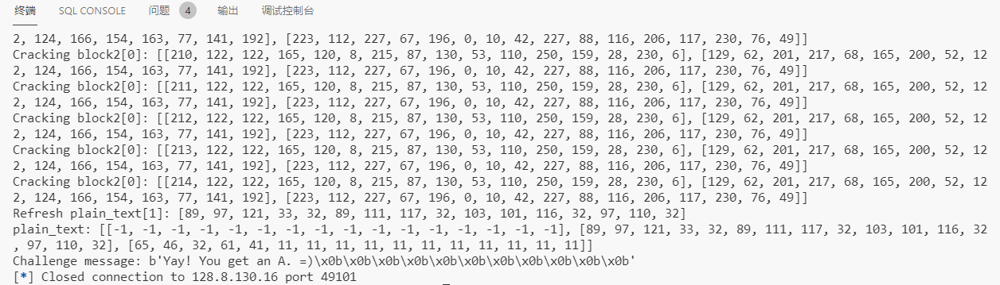
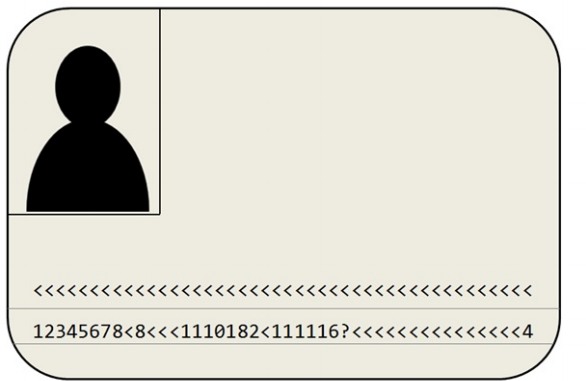
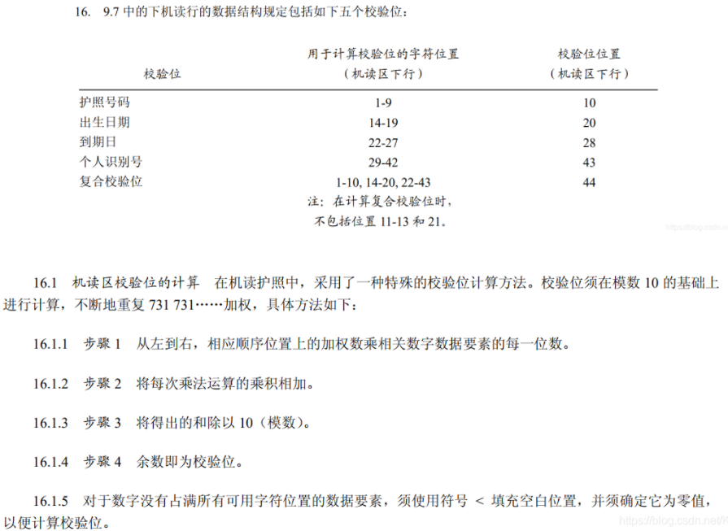
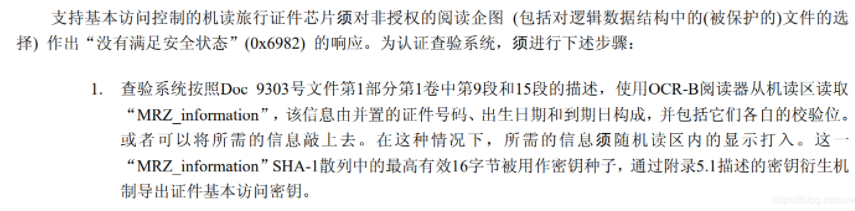
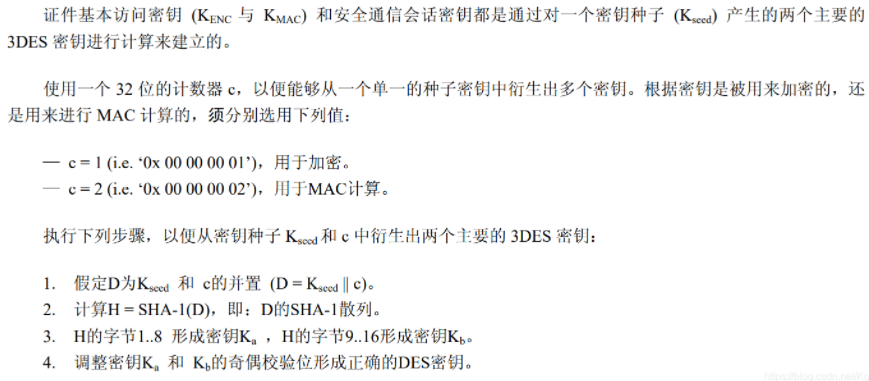

《现代密码学》课程大作业

# 实验思路

## 实验 1

### 思路

通过阅读题意和查询资料得到攻击方法为**padding oracle attack**，于是搜索相关博客，恰好找到了一篇学长的博客，但是他的表达方式不能完全理解，于是加上了自己的推理来脑部出了完整的攻击流程，然后摸索着实现代码——由于远程服务器很不稳定，所以需要优化一下。

最后和远程交互慢慢爆破出明文：



## 实验 2

### 1. Byte-at-a-time ECB decryption (Harder)

#### 题目要求：

在加密前，在明文后面添加一段文本（添加之前需要对该文本进行Base64解码）。文本如下

```
Um9sbGluJyBpbiBteSA1LjAKV2l0aCBteSByYWctdG9wIGRvd24gc28gbXkg
aGFpciBjYW4gYmxvdwpUaGUgZ2lybGllcyBvbiBzdGFuZGJ5IHdhdmluZyBq
dXN0IHRvIHNheSBoaQpEaWQgeW91IHN0b3A/IE5vLCBJIGp1c3QgZHJvdmUg
YnkK
```

使用一个恒定未知的密钥，通过ECB模式加密。加密函数格式为：

`AES-128-ECB(your-string || unknown-string, random-key)`

现在，已知加密函数的接口encrypt(string)，需要解密"unknown-string"。

#### 实现方法：

1. 通过不断对”A”、”AA”、”AAA”……加密，通过密文块的长度以及填充规则，来获得加密块的大小。

2. 测试加密模式是否为ECB。

3. 将your-string设置为”AAAAAAA”，进行加密，提取第一个密文块，为”AAAAAAAB1”的加密结果，B1为unknown-string的第一个字符；然后尝试对”AAAAAAAX”加密，X为任意字符，同样提取第一个密文块，与刚才密文块对比，找到与其相同的密文块，即可以找到unknown-string的第一个字符。

4. 以此类推，即可求得unknown-string。

### 2. PKCS#7 padding validation

#### 题目要求：

检查一段文本，是否为有效的PKCS#7填充，如果是，则去掉填充。

示例：

```
string1=“ICE ICE BABY\x04\x04\x04\x04” 为有效填充，结果为”ICE ICE BABY”。
string2=“ICE ICE BABY\x05\x05\x05\x05” 不是有效填充。
string3=“ICE ICE BABY\x01\x02\x03\x04” 不是有效填充。
```

#### 实现方法：

1. 提取字符串最后一位c，转化为10进制数，即为填充长度paddingCount。
2. 比较字符串的倒数paddingCount的位置上的字符是否等于c，如果相等，则为有效填充。

### 3. CBC bit flipping attack

#### 题目要求：

首先生成一个随机AES密钥，然后实现两个功能。

1. 功能1：对于userdata，在前面添加 “comment1=cooking%20MCs;userdata=”，在字符串后面添加 ”;comment2=%20like%20a%20pound%20of%20bacon”，然后对该文本进行填充和加密，返回加密后的结果。对于userdata的内容，不允许存在”;“和”=“。

2. 功能2：解密字符串，语法分析查找是否存在”admin=true;“，返回True或False。

如果函数1实现正确，那么不会出现函数2中查找的字符串。

现在，需要做的是修改密文，基于CBC模式的[比特翻转攻击](https://en.wikipedia.org/wiki/Bit-flipping_attack)，来使其可以找到。

#### 实现方法：

1. **profile_for(string)**：输入用户数据字符串string，如果其中包含”;“或”=“，则替换为”=“。将字符串前面和后面添加指定的字符串。

2. **parsestring(string)**：首先将使用split(‘;’)对字符串进行分割，对分割后的每一块进行分析。以’=‘为基准，前面部分为关键字，后面部分为值，添加到account字典中。

3. **attack()**：
   - 在userdata中如果输入”;admin=true”，经过配置函数之后，会更改为”_admin_true”。_
   - 我们可以计算出两个更改后的’_‘位置为32和38；由于CBC模式是将前一个密文块异或到后一个明文块上进行加密的，因此我们可以通过更改相应密文的前一个密文块，来实现将其解密为’;admin=true’。

### 4. MTC3 AES KEY

#### 题目分析

1. AES加密模式为CBC，初始化矢量即IV为零，填充为01-00。此外，相应的密钥在身份证件上的机器可读区域（MRZ）等表格中，它与欧洲的电子护照一起使用时并不十分完整。

   

2. 目标是找到以下base64编码消息的明文：

```
9MgYwmuPrjiecPMx61O6zIuy3MtIXQQ0E59T3xB6u0Gyf1gYs2i3K9Jxaa0zj4gTMazJuApwd6+jdyeI5iGHvhQyDHGVlAuYTgJrbFDrfB22Fpil2NfNnWFBTXyf7SDI
```
   3、对于加密，已生成并应用基于基本访问控制（BAC）协议的密钥KENC。对于解密，已经发送了以下字符，从中可以导出KENC（这些字符的编码类型在[1]中描述）：`12345678 <8 <<< 1110182 <111116？<<<<<<<<<<<<<<< 4`

4. 在传输过程中丢失了并且突出显示了一个’’？’’。可以在[2]的帮助下恢复它。为了能够在之后计算密钥KENC，可以找到应用编码的概述[3]，[4]中的协议和[5]中的一个例子。

6. 5. 在解密之前解码base64代码。

总而言之，就是根据它给的那一串数字，然后按照它参考文章里面用到的方法去还原加密的明文。

#### 解题思路

1. 求未知数字

   

2. 根据得到的数字计算出key

   核心步骤,大体上分为:

   - 求Kseed

     这部分也是按照参考文章，可以轻松的得到Kseed

     

   - 求Ka和Kb

     

   - 对Ka和Kb奇偶校验生成key

3. 拿key和base64解码后的密文解密

## 实验 3

详见实验3目录下的 [report.docx](https://github.com/yikesoftware/cryptography_assignment/blob/main/作业3%20RSA大礼包/report.docx)

# 实验心得

1. 密码学实验通常来说看懂题意最重要，难点通常也在于对题目的理解，遇到复杂难懂的可以主动查资料来分析
2. 善用前人的经验可以帮助自己快速学习，但是看前人思路的基础上最好尝试着自己优化并独立实现
3. 代码实现能力同样非常重要，决定了能不能很好的把预想的攻击思路转化为代码